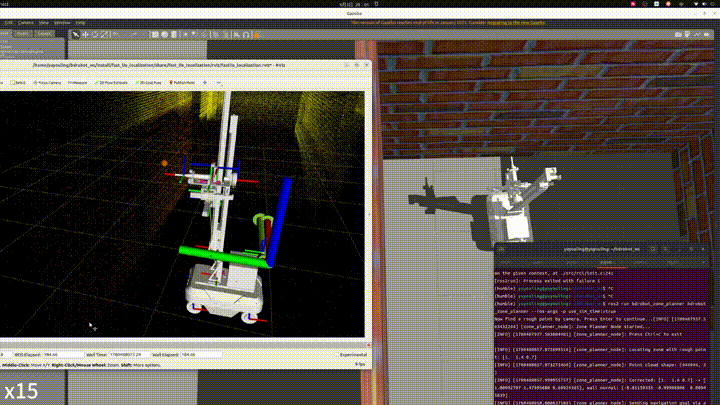

# 混凝土回弹检测机器人系统

仿真：Gazebo + Livox mid360 + BDRobot

算法：FastLIO + FastLIO-Localization + A* + TEB

功能：基于激光雷达的回弹检测机器人系统，使用nav2与moveit2协同底盘和机械臂实现对混凝土回弹检测的定位、规划和控制。

## 运行指令

ros2 launch bdrobot_arm_controller bdrobotarm_executor_demo.launch.py

ros2 launch bdrobot_gazebo bdrobot_fastlio_localization.launch.py

ros2 run robot_self_filter robot_self_filter --ros-args -p use_sim_time:=true  # 自创本体滤波

ros2 launch bdrobot_navigation bdrobot_nav2.launch.py

ros2 run bdrobot_zone_planner bdrobot_zone_planner --ros-args -p use_sim_time:=true

## 仿真演示

